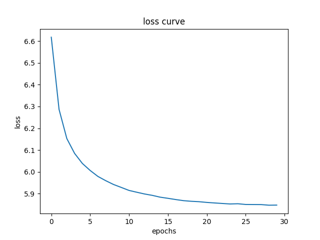
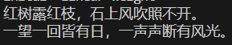
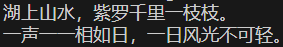
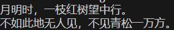

## RNN, LSTM 与 GRU

### RNN

RNN是一种专门用于处理序列问题的神经网络架构，核心特点是将序列的数据每个步有一个hidden state，这个hidden state可能仅和当前步输入有关，也有可能同时和历史输出有关，可能是传统的一个vector，也可以是一个matrix，该hidden state会随着序列的进行而不断演化，这种记忆能力能有效地捕捉时间依赖关系，但是也可能在长文本任务上达到hidden state信息表征瓶颈从而表现不如Transformer。

### LSTM

LSTM是RNN的一种变体，它在原始直接相加hidden statRNN的基础上增加了记忆细胞逻辑，使得它能够更好地捕捉时间依赖关系。LSTM的记忆细胞由四个门组成，即input gate，forget gate，output gate和cell gate，fen分别负责输入，遗忘，输出和更新记忆细胞的状态。LSTM的记忆细胞状态可以看作是一种特殊的门控单元，它能够在一定程度上解决长期依赖问题。

### GRU

GRU也是一种RNN的变体，它在LSTM的基础上进一步简化了记忆细胞的结构，使得它更加适合处理长序列任务。GRU的记忆细胞由两个门组成，即重置门和更新门，重置门负责重置记忆细胞状态，更新门负责更新记忆细胞状态。GRU的记忆细胞状态可以看作是一种特殊的门控单元，它能够在一定程度上解决长期依赖问题。

## 诗歌生成过程

### 数据预处理

首先将诗歌文本按照NLP的处理方法使用词表tokenize成`token_ids`，并且也根据`BEG`, `END`等特殊`token`的设计，添加一些特殊标记

### 模型构建与训练

使用RNN（此处使用2层单向LSTM）进行下个`token`的概率预测，在本实验中使用负对数似然函数来进行损失函数来反向传播训练。

### 生成过程

使用上一步训练出的RNN模型进行推理，将首个字作为样本输入，使用模型预测最大概率的`token`，并且不断生成下一个`token`，直到输出作为生成结束标记的`token`为止，将所有生成的`token`连在一起就是模型生成的诗歌。

## 实验结果

训练loss曲线如下：

使用训练好的模型进行输出的某些结果如下：

可以看到，在tokenizer设计正确情况下，对于一个汉字可以一直按照诗歌的方式输出，并且生成的诗歌也比较符合人们的审美。